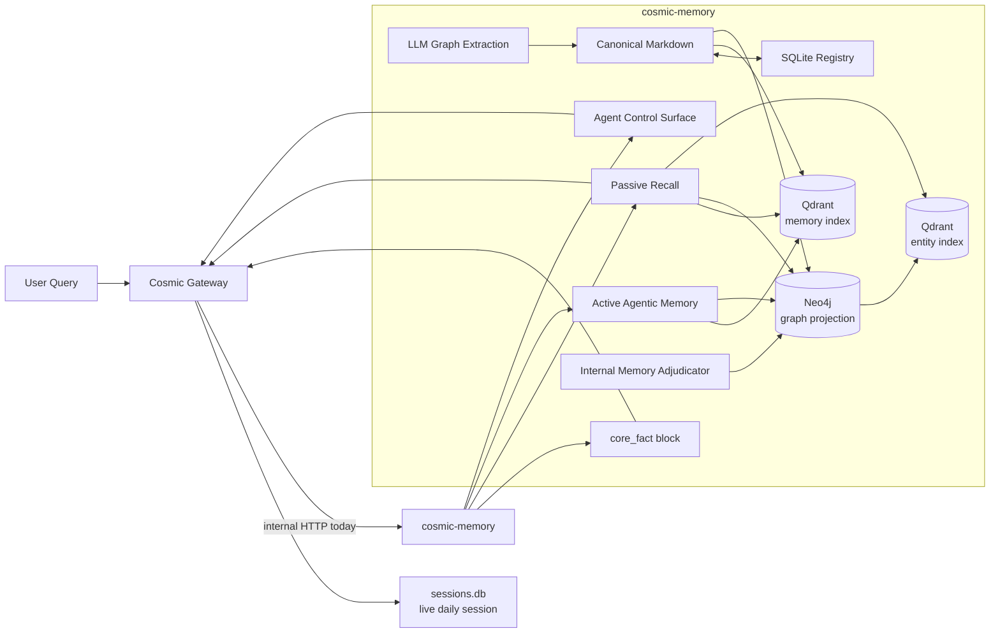
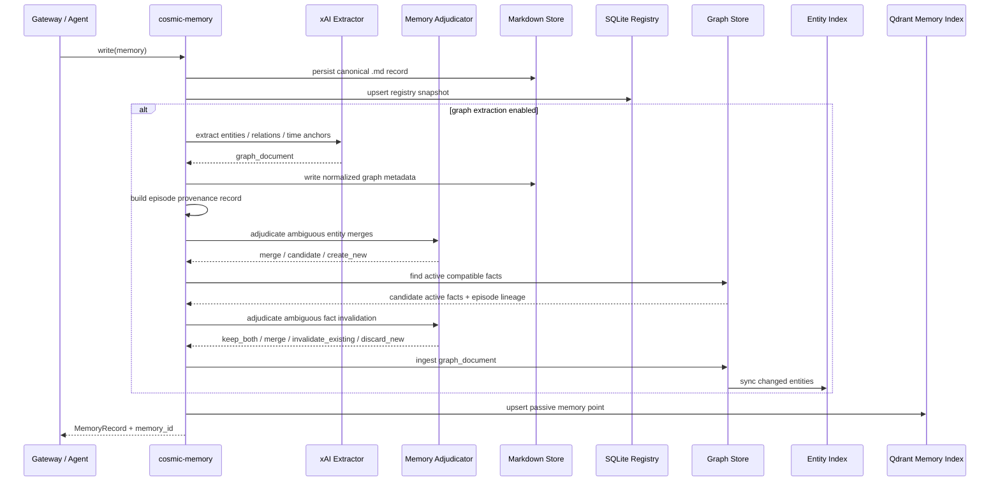
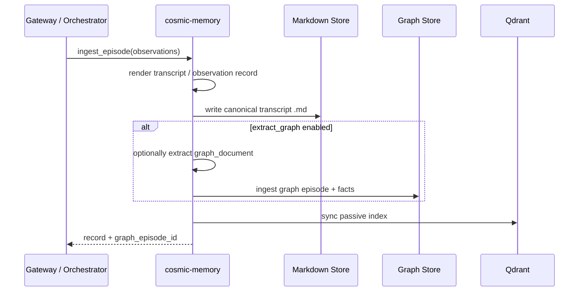
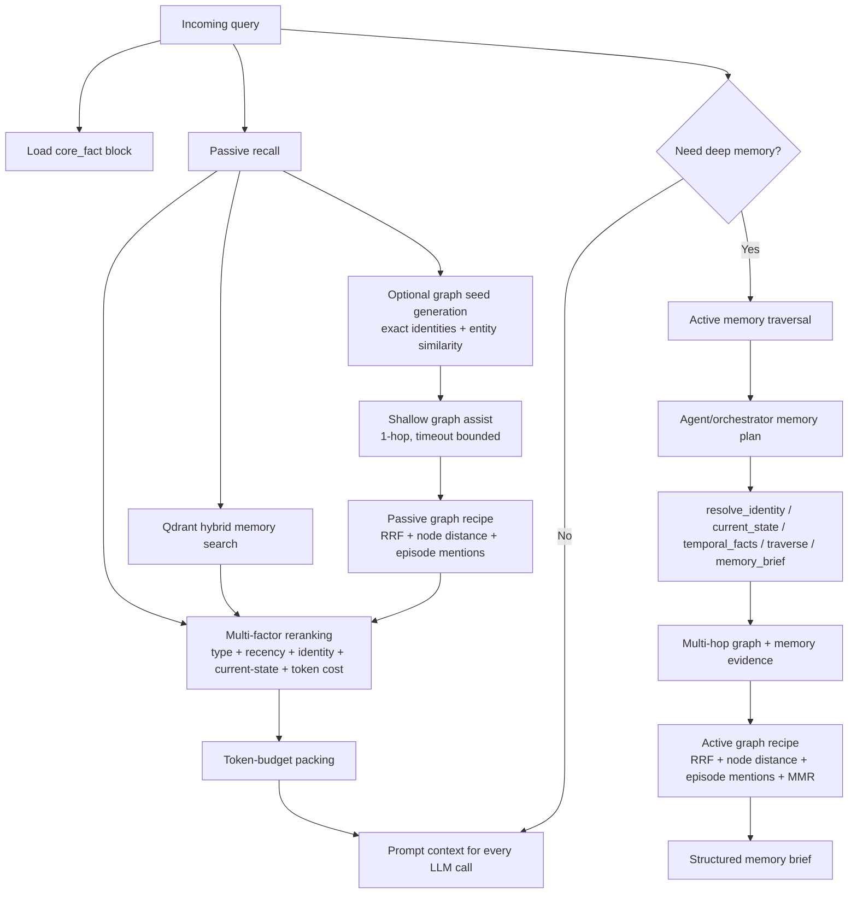

# cosmic-memory

Memory layer for Cosmic.

This repository is the foundation for Cosmic's long-term memory system. It is
being built as a library-first Python package with an optional API server so
Cosmic can:

- keep memory logic isolated from the Gateway and agents,
- preserve a clean library-first core while supporting loopback HTTP integration,
- expose stable internal endpoints for orchestrator and agent use,
- evolve the memory layer independently over time.

## Design Direction

The intended Cosmic memory stack is:

- `core_fact`
  - always-on user profile and standing preferences
- passive recall
  - fast retrieval for every query
  - canonical records -> Qdrant hybrid retrieval
- active agentic memory
  - deep search, traversal, contradiction handling, graph projection

This repo is not intended to own Cosmic's live message/session routing. The
Gateway still owns the current-day session store and conversation orchestration.
`cosmic-memory` owns canonical long-term memory, retrieval contracts, and
memory-layer operations.

## Architecture

### System Boundaries



### Write And Ingestion Flow



### Observation Ingestion



### Passive And Active Retrieval



## Current Scope

The current milestone in this repo provides:

- project scaffolding,
- core memory schemas and service interfaces,
- first-class `core_fact` writes and deterministic profile block rendering,
- canonical Markdown record storage,
- a memory-owned SQLite registry,
- a filesystem-backed canonical memory service,
- an isolated embedding subsystem,
- a dedicated `/v1/embeddings/generate` endpoint,
- a Qdrant passive-recall adapter using native BM25 by default,
- startup and on-demand index sync/rebuild operations,
- token-budget-aware passive recall with multi-factor reranking,
- graph ontology and deterministic identity normalization foundations,
- write-time xAI graph extraction with structured output support,
- internal xAI-backed entity adjudication for ambiguous graph writes,
- internal xAI-backed fact adjudication for ambiguous active-fact invalidation,
- document-level graph dedup normalization before graph ingest,
- a dedicated entity-similarity index for entity candidate generation and graph seeding,
- first-class graph episodes for provenance and lineage,
- structured active-fact lookup for compatible entities, relations, and time windows,
- on-ingest fact invalidation that keeps stale facts out of current-state traversal,
- internal graph retrieval recipes for passive and active graph-backed recall,
- graph-assisted passive recall and graph-first active recall when a graph store is attached,
- a compact agent/orchestrator memory control surface,
- schema injection, query planning, identity resolution, current-state lookup, temporal fact lookup, and structured memory briefs,
- a first-class `ingest_episode(...)` path for turning runtime observations into canonical transcript memories,
- a thin FastAPI server,
- an in-memory development implementation for contract testing.

That gives us a real shape for the system before wiring in:

- consolidation and supersession jobs.

## Repository Layout

```text
src/cosmic_memory/
  control_surface.py # agent/orchestrator-facing memory control surface
  core_facts.py # deterministic always-on profile block helpers
  domain/      # schemas, enums, contracts
  embeddings/  # dense embedding services
  extraction/  # graph extraction and normalization
  graph/       # ontology, identity resolution, traversal, entity similarity
  index/       # passive recall index adapters
  storage/     # canonical markdown + sqlite registry
  server/      # FastAPI wrapper
  service.py   # abstract memory service contract
  dev_service.py
  filesystem_service.py
docs/
  architecture.md
tests/
```

## Quick Start

```bash
python -m pip install -e .[dev]
python -m uvicorn cosmic_memory.server.app:create_default_app --factory --reload
pytest -q
```

Production behavior:

- `create_default_app()` is production-oriented and env-backed.
- `create_filesystem_app()` is the same production path with an optional custom
  data directory.
- `create_development_app()` is the only deterministic local fallback path.

`create_default_app()` and `create_filesystem_app()` require
`PERPLEXITY_API_KEY` and use Perplexity standard embeddings with
`pplx-embed-v1-4b`.

If `XAI_API_KEY` is present, production app factories also enable write-time
graph extraction with `grok-4-1-fast-reasoning` by default.

Production app factories also load a local `.env` file if present. A placeholder
is included in [.env.example](C:/Users/Praveen Raj U S/Downloads/cosmic-memory/.env.example).

## Current Gateway Integration

The current thin Cosmic Gateway is now integrated with `cosmic-memory` over an
internal HTTP boundary.

What is live today in the Gateway integration:

- every inbound query still uses `sessions.db` as the short-term conversation source,
- the Gateway fetches the deterministic `core_fact` block from `GET /v1/core-facts`,
- the Gateway runs passive recall through `POST /v1/query/passive`,
- the resulting memory block is injected into direct-route and orchestrator prompts,
- the model-router also receives the assembled long-term memory block during classification,
- completed user/assistant turns are ingested back into `POST /v1/episodes` as transcript episodes,
- daily session rollover summaries are written into long-term memory through the Gateway rollover path,
- the Gateway exposes internal proxy routes for future `MemoryRead` / `MemoryWrite` style tooling:
  - `POST /internal/memory/search`
  - `POST /internal/memory/active-search`
  - `POST /internal/memory/write`
  - `POST /internal/memory/core-facts`
  - `GET /internal/memory/core-facts`
  - `POST /internal/memory/episodes`

Important current limitation:

- the thin Gateway integration injects long-term memory into direct/orchestrator
  prompt assembly,
- active agentic memory is still opt-in via the control surface rather than part
  of the normal Gateway query path,
- task-summary writes and agent-note sync are still the next Gateway-side
  integrations to finish.

Gateway environment variables for the current integration:

- `COSMIC_MEMORY_URL` (for example `http://127.0.0.1:8090`)
- `COSMIC_MEMORY_TIMEOUT_SEC` (default `12`)
- `COSMIC_MEMORY_CORE_FACT_MAX_CHARS` (default `1500`)
- `COSMIC_MEMORY_PASSIVE_MAX_RESULTS` (default `8`)
- `COSMIC_MEMORY_PASSIVE_TOKEN_BUDGET` (default `12000`)
- `COSMIC_MEMORY_PASSIVE_KINDS` (default `session_summary,task_summary,agent_note,user_data`)
- `COSMIC_MEMORY_INGEST_TRANSCRIPTS` (default `true`)
- `COSMIC_MEMORY_EPISODE_EXTRACT_GRAPH` (default `false`)

Relevant environment variables:

- `PERPLEXITY_API_KEY`
- `XAI_API_KEY`
- `COSMIC_MEMORY_EMBEDDING_MODEL` (default `pplx-embed-v1-4b`)
- `COSMIC_MEMORY_EMBEDDING_DIMENSIONS` (default `1024`)
- `COSMIC_MEMORY_EMBED_BATCH_SIZE` (default `128`)
- `COSMIC_MEMORY_EMBED_MAX_PARALLEL` (default `4`)
- `COSMIC_MEMORY_EMBED_ENCODING` (default `base64_int8`)
- `COSMIC_MEMORY_QDRANT_URL` or `COSMIC_MEMORY_QDRANT_PATH`
- `COSMIC_MEMORY_QDRANT_COLLECTION` (default `memories`)
- `COSMIC_MEMORY_SPARSE_MODEL` (default `Qdrant/bm25`)
- `COSMIC_MEMORY_SPARSE_BACKEND` (`auto`, `native`, `fastembed`, or `simple`; default `auto`)
- `COSMIC_MEMORY_ENTITY_INDEX_ENABLED` (default `true`)
- `COSMIC_MEMORY_ENTITY_COLLECTION` (default `memory_entities`)
- `COSMIC_MEMORY_ENTITY_QDRANT_PATH` (optional override for embedded local entity-index storage)
- `COSMIC_MEMORY_PASSIVE_GRAPH_TIMEOUT_MS` (default `120`)
- `COSMIC_MEMORY_SYNC_ON_STARTUP` or `MEMORY_SYNC_ON_STARTUP` (default `true`)
- `COSMIC_MEMORY_GRAPH_BACKEND` (`none`, `memory`, or `neo4j`, default `none`)
- `COSMIC_MEMORY_NEO4J_URI`
- `COSMIC_MEMORY_NEO4J_USERNAME`
- `COSMIC_MEMORY_NEO4J_PASSWORD`
- `COSMIC_MEMORY_NEO4J_DATABASE` (default `neo4j`)
- `COSMIC_MEMORY_GRAPH_EXTRACT_ENABLED` (default `false`; enable explicitly when `XAI_API_KEY` is present and graph extraction is desired)
- `COSMIC_MEMORY_GRAPH_EXTRACT_MODEL` (default `grok-4-1-fast-reasoning`)
- `COSMIC_MEMORY_GRAPH_EXTRACT_MAX_PARALLEL` (default `2`)
- `COSMIC_MEMORY_GRAPH_EXTRACT_MAX_RETRIES` (default `3`)
- `COSMIC_MEMORY_GRAPH_EXTRACT_RETRY_BASE_SECONDS` (default `1.0`)
- `COSMIC_MEMORY_GRAPH_EXTRACT_RETRY_MAX_SECONDS` (default `12.0`)
- `COSMIC_MEMORY_GRAPH_ADJUDICATE_ENABLED` (default `true` when `XAI_API_KEY` is present)
- `COSMIC_MEMORY_GRAPH_ADJUDICATE_MODEL` (default `grok-4-1-fast-reasoning`)
- `COSMIC_MEMORY_GRAPH_ADJUDICATE_MAX_PARALLEL` (default `2`)
- `COSMIC_MEMORY_GRAPH_ADJUDICATE_MAX_RETRIES` (default `3`)
- `COSMIC_MEMORY_GRAPH_ADJUDICATE_RETRY_BASE_SECONDS` (default `1.0`)
- `COSMIC_MEMORY_GRAPH_ADJUDICATE_RETRY_MAX_SECONDS` (default `12.0`)
- `COSMIC_MEMORY_GRAPH_FACT_ADJUDICATE_ENABLED` (default `true` when `XAI_API_KEY` is present)
- `COSMIC_MEMORY_GRAPH_FACT_ADJUDICATE_MODEL` (default `grok-4-1-fast-reasoning`)
- `COSMIC_MEMORY_GRAPH_FACT_ADJUDICATE_MAX_PARALLEL` (default `2`)
- `COSMIC_MEMORY_GRAPH_FACT_ADJUDICATE_MAX_RETRIES` (default `3`)
- `COSMIC_MEMORY_GRAPH_FACT_ADJUDICATE_RETRY_BASE_SECONDS` (default `1.0`)
- `COSMIC_MEMORY_GRAPH_FACT_ADJUDICATE_RETRY_MAX_SECONDS` (default `12.0`)
- `COSMIC_MEMORY_TIMEZONE` (default `UTC`)
- `COSMIC_MEMORY_ENV_FILE` (default `.env`)

Passive retrieval notes:

- dense vectors come from Perplexity embeddings,
- sparse retrieval defaults to Qdrant-native BM25,
- `COSMIC_MEMORY_SPARSE_BACKEND=auto` uses FastEmbed sparse encoding for local-path Qdrant and keeps native BM25 for remote/server Qdrant,
- `qdrant-client>=1.15.2` is required for the native BM25 path,
- local-path Qdrant with native BM25 also requires `fastembed` in the client environment,
- explicit sparse encoders are still supported for tests and older environments.
- passive recall overfetches a bounded candidate window, reranks by lexical/index score, type, recency, exact identity hits, current-state hints, graph support, and token cost,
- final selection packs the token budget instead of blindly taking the biggest top hit,
- graph assistance is shallow and bounded by timeout so it can improve recall without owning the hot path.

Graph notes:

- identity keys are deterministic and normalized before hashing,
- exact strong keys such as email auto-link entities,
- weak alias keys do not auto-merge by themselves,
- non-person entities such as `project`, `task`, and `organization` can auto-merge by exact normalized name,
- entity similarity uses a separate Qdrant collection and the same Perplexity embedding model as passive memory,
- vector similarity is only used for shortlist generation after exact identity and normalized-name checks,
- ambiguous entity creation and merge decisions can be escalated to an internal xAI adjudicator,
- ambiguous active-fact conflicts can be escalated to an internal xAI fact adjudicator,
- ambiguous similarity hits become provisional `candidate_match` results instead of silent auto-merges,
- write-time extraction stores normalized `graph_document` payloads back into canonical Markdown,
- every ingested graph document now produces a first-class `episode` with source excerpt, timestamps, extraction confidence, and lineage to produced/invalidated relations,
- graph stores expose structured active-fact lookup internally by entity ids, compatible relation families, active-state filter, and time window,
- fact invalidation runs on ingestion, not on cron, so current-state traversal does not leak stale facts between writes,
- there is now a deterministic invalidation fallback for obvious same-pair, same-relation updates with a newer valid time, even when the LLM fact adjudicator is off,
- `GraphFactQuery.source_entity_ids` and `target_entity_ids` are directional filters, while `anchor_entity_ids` match either side of a relation,
- `prefer_current_state=false` is a historical traversal mode and may surface invalidated relations intentionally,
- graph search results are now passed through internal recipes before memory hydration:
  - passive graph assist uses a cheap hybrid recipe where RRF materially contributes alongside lexical/state/node-distance/episode signals,
  - active traversal uses the same hybrid scoring plus MMR diversification to avoid repeating near-duplicate relations,
- `relation_distances` in graph results are explicitly 1-indexed hop counts from the nearest seed entity,
- extraction prompts are explicitly time-aware and resolve relative dates against UTC and local timezone anchors,
- passive graph seeding can use the entity-similarity index to resolve indirect references like `todo` -> `task`,
- transcript observations can opt into graph extraction through `ingest_episode(...)` even though transcript memories are not extracted by default,
- current graph backend support in the app factory is intentionally limited to:
  - `memory` for local/dev validation
  - `neo4j` as the first persistent backend boundary
  - `none` when graph traversal is disabled

Benchmarking:

- `python benchmarks/passive_recall_benchmark.py --mode inprocess`
- the benchmark reports `p50`, `p80`, `p95`, top-1 hit rate, any-hit rate, and token-budget compliance
- `--mode http --base-url http://127.0.0.1:8000` exercises the HTTP boundary end to end

Current server endpoints:

| Method | Path | Purpose | Used By | Notes |
| --- | --- | --- | --- | --- |
| `GET` | `/health` | Health/status check for the service. | Infra, local dev, Gateway | Not memory-specific. |
| `POST` | `/v1/embeddings/generate` | Generate dense embeddings through the configured embedding backend. | Internal tooling, diagnostics, future batch jobs | Not on the normal recall hot path. |
| `POST` | `/v1/memories` | Write a canonical long-term memory record. | Gateway, agents, orchestrator | Canonical `.md` write path. |
| `POST` | `/v1/episodes` | Turn runtime observations into a canonical transcript/episode record. | Gateway, orchestrator | High-level observation ingestion path. Can optionally trigger graph extraction. |
| `GET` | `/v1/memories/{memory_id}` | Fetch one canonical memory by ID. | Gateway, agents, orchestrator | Direct record lookup. |
| `POST` | `/v1/memories/{memory_id}/supersede` | Supersede an existing memory with a replacement record. | Gateway, agents, consolidation jobs | Preserves history instead of blind overwrite. |
| `POST` | `/v1/core-facts` | Write a first-class `core_fact` record. | Gateway, profile updates, agents | Supports `canonical_key`-based supersession. |
| `GET` | `/v1/core-facts` | Build the deterministic always-on core profile block. | Gateway | Hot prompt-assembly dependency. |
| `POST` | `/v1/query/passive` | Fast token-budgeted passive recall for every query. | Gateway | Hot path. Qdrant-first, graph-assisted. |
| `POST` | `/v1/query/active` | Deep memory search and graph-backed active recall. | Orchestrator, agents | Not hot path. Used for harder memory tasks. |
| `GET` | `/v1/agent/schema-context` | Return ontology, memory kinds, and tool guidance for planning. | Orchestrator, agents | Schema injection surface. |
| `POST` | `/v1/agent/plan` | Convert a query into a memory search plan. | Orchestrator, agents | Planning helper, not raw DB access. |
| `POST` | `/v1/agent/resolve-identity` | Normalize and resolve identity keys such as email or username. | Orchestrator, agents | Exact identity tool. |
| `POST` | `/v1/agent/current-state` | Return current facts such as blockers, reminders, ownership, or active work. | Orchestrator, agents | Current-state oriented graph lookup. |
| `POST` | `/v1/agent/temporal-facts` | Return historical or time-bounded facts. | Orchestrator, agents | For before/after/when questions. |
| `POST` | `/v1/agent/memory-brief` | Build a structured memory brief from passive + active evidence. | Orchestrator, agents | High-level agent-facing synthesis tool. |
| `GET` | `/v1/index/status` | Report canonical/registry/index consistency state. | Ops, local dev, maintenance jobs | Control-plane endpoint. |
| `POST` | `/v1/index/sync` | Repair drift between canonical files, registry, and passive index. | Ops, startup hooks, maintenance jobs | Incremental repair path. |
| `POST` | `/v1/index/rebuild` | Rebuild the passive index from canonical records. | Ops, maintenance jobs | Full rebuild path. |

Index behavior is aligned with the current Cosmic architecture:

- canonical Markdown remains the source of truth,
- the SQLite registry is a fast lookup/cache layer for canonical records,
- Qdrant is treated as a rebuildable passive index,
- startup sync can repair registry/index drift from canonical files,
- passive recall enforces a fixed token budget before returning memories.

Graph behavior follows the same pattern:

- canonical Markdown stays authoritative,
- graph episodes and relations are projections derived from canonical memories,
- ambiguous entity creation and fact invalidation stay inside `cosmic-memory`,
- active-state graph queries prefer current facts and exclude invalidated facts by default.

## Agent Control Surface

The agent-facing API is intentionally small. It is not meant to expose raw graph
or index internals; it is meant to give the orchestrator stable memory
primitives:

Memory authoring intentionally follows the same rule: agents are expected to
call high-level canonical write paths, while entity-candidate retrieval and
ambiguous merge decisions stay inside `cosmic-memory` as an internal
adjudication step.

- `schema_context`
  - inject ontology, memory kinds, relation types, and tool guidance before complex planning
- `plan`
  - convert a user/task query into a memory search plan with recommended mode and tool sequence
- `resolve_identity`
  - normalize exact keys like email or username before traversal
- `current_state`
  - return active facts such as blockers, owners, reminders, preferences, and current work
- `temporal_facts`
  - return time-aware facts for before/after/when/history questions
- `memory_brief`
  - bundle passive recall, active recall, current/temporal facts, and distilled findings for the orchestrator

This keeps memory reasoning inside `cosmic-memory` instead of forcing every
agent to relearn the ontology, traversal strategy, and ranking heuristics.

## Near-Term Plan

1. Finish Gateway compaction and daily-rollover summary writes through `cosmic-memory`.
2. Wire shared memory tooling and the control surface into orchestrator/agent runtimes.
3. Add consolidation and conflict-resolution jobs.
4. Add extraction queues, caches, and production observability.
5. Add richer evaluation over real Cosmic memory traffic.
